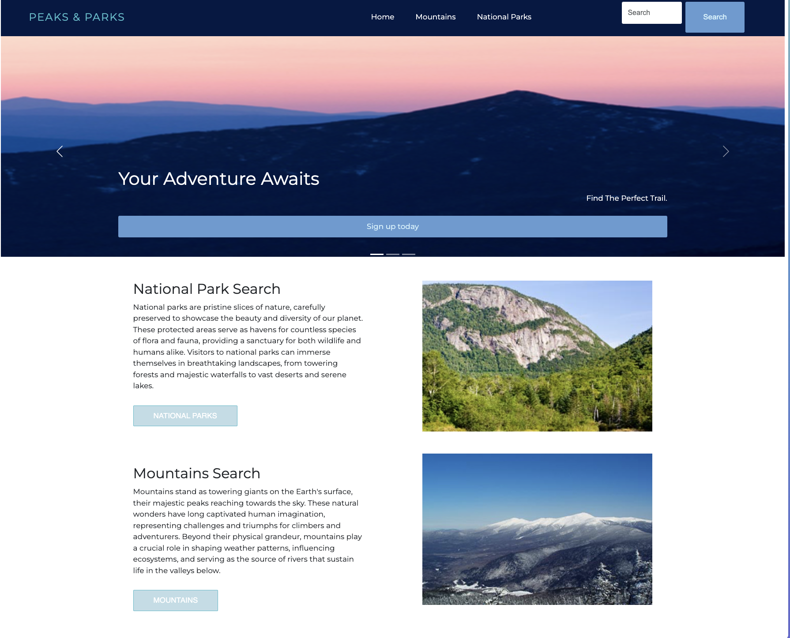
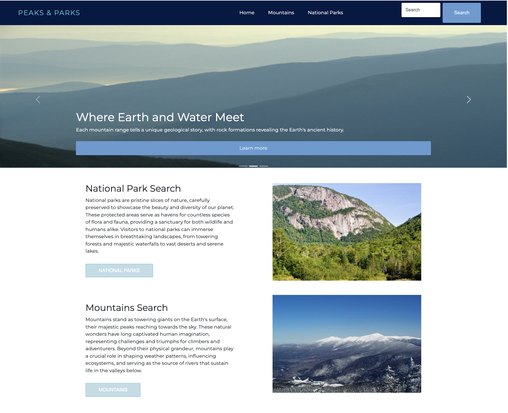
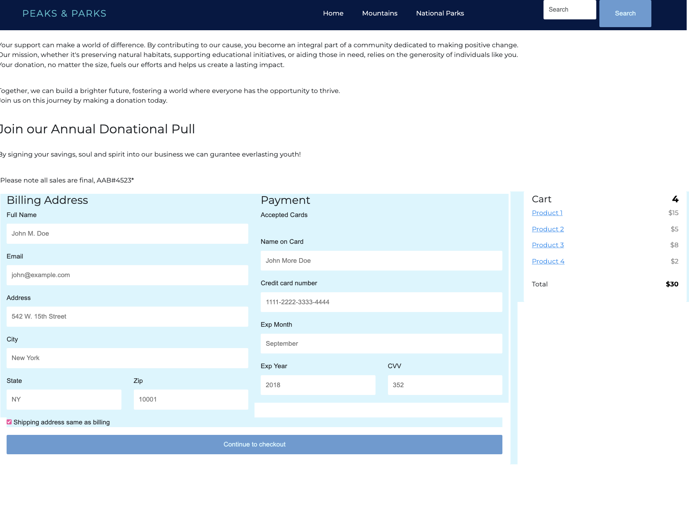
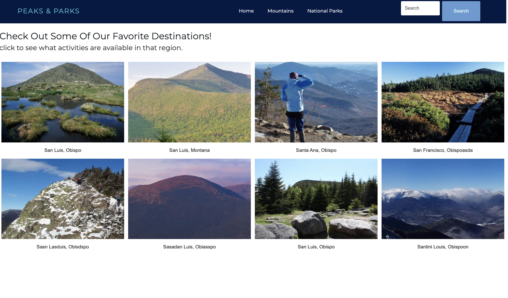

# Introduction
Peaks & Parks is a website dedicated to helping you discover the perfect national parks and mountains for your outdoor adventures.

## Built With
-[HTML] (#html)
-[CSS] (#css)
-[Bootstrap] (#bootstrap)
-[Javascript] (#javascript)

## Page Descriptions

## Index.html
   Home page of the website

   
   

## Mountain-Page, Mountain.html 
   These pages manage the user exoerience pertaining to account creatuin and user authention, allowuing users to access the website.

   

## Nat-parks.html
   A dedicated page to display inventory available for purchase.

   
   
## Signup.html
   This page presents all the necesarry information and options related to the checkout process. Including paymemt options and adding items to a shopping cart.

   

## browseGallery.html
   This page presents all the necesarry information and options related to the checkout process. Including paymemt options and adding items to a shopping cart.

   

## Deployed link
   Visit Live Site

## Sample Screenshot 
Here is a sample image screenshot of the website:

   

